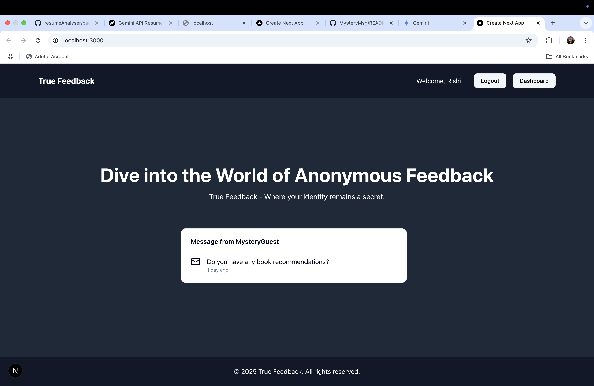
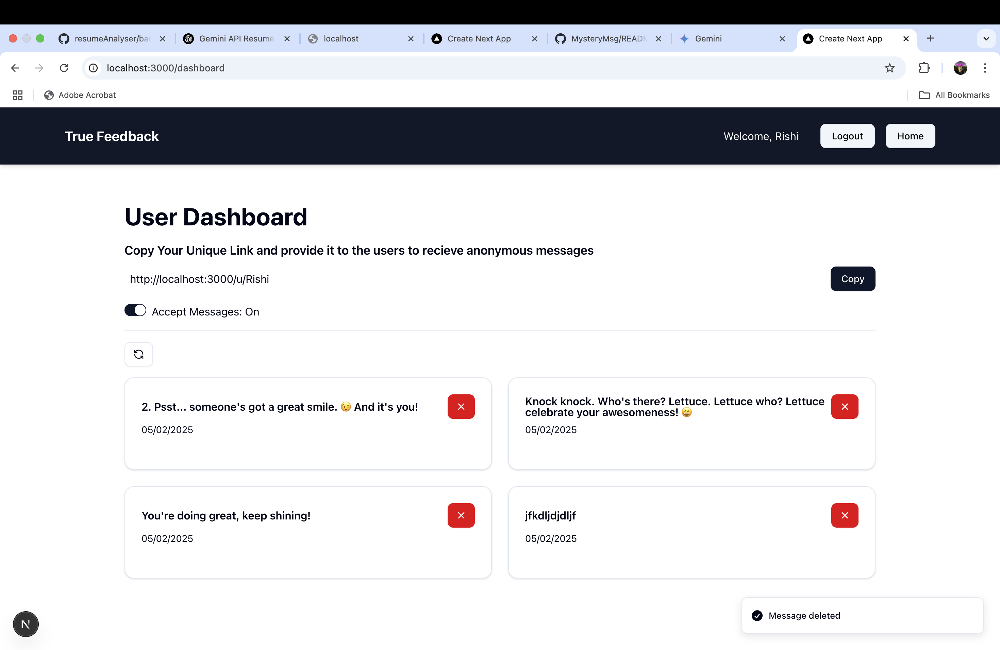
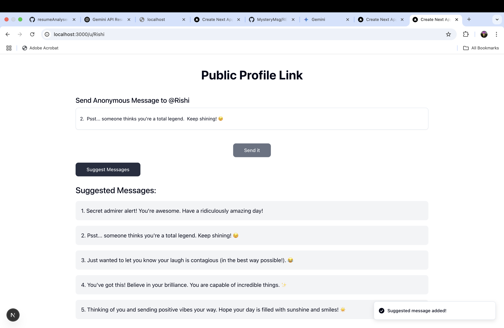

# LinkLeap - Receive Anonymous Messages






## Overview

LinkLeap is a web application that allows users to receive anonymous messages. Once a user creates an account and signs in, they are directed to their personal dashboard. On this dashboard, they can:

* **View Messages:** See all the anonymous messages sent to them.
* **Delete Messages:** Remove unwanted messages.
* **Share Public Profile Link:** Obtain a unique link to their public profile page.
* **Receive Anonymous Messages:** People with the public profile link can send anonymous messages to the user.
* **Toggle Message Reception:** Control whether or not they want to receive new anonymous messages via a simple switch.

This application provides a unique way for users to receive feedback, compliments, or even just random thoughts from others anonymously.

## Technologies Used

This project utilizes the following key technologies:

**Frontend:**

* **Next.js:** A React framework for building the user interface.
* **React:** A JavaScript library for building UI components.
* **Tailwind CSS:** A utility-first CSS framework for styling.
* **shadcn/ui:** A collection of accessible and reusable UI components built with Radix UI and Tailwind CSS.
* **React Hook Form:** For managing and validating forms.
* **Zod:** For schema declaration and validation.

**Backend & Authentication:**

* **Next.js (API Routes):** For handling server-side logic.
* **MongoDB & Mongoose:** For database management.
* **NextAuth.js:** For user authentication.
* **bcryptjs:** For password hashing.

**AI Suggestions:**

* **@google/generative-ai:** For potential AI-powered features or suggestions.

**Other:**

* **axios:** For making HTTP requests.
* **resend & React Email:** For handling email functionality.
* **sonner:** For displaying user notifications.

## Getting Started

To run **LinkLeap** locally, follow these steps:

1.  **Clone the repository:**
    ```bash
    git clone <repository-url>
    cd linkleap
    ```

2.  **Install dependencies:**
    ```bash
    npm install
    # or
    yarn install
    # or
    pnpm install
    ```

3.  **Set up environment variables:**
    Create a `.env.local` file in the root directory and configure the necessary environment variables. This will likely include:
   * AUTH_SECRET=your_auth_secret_here
   * AUTH_GITHUB_ID=your_github_client_id
   * AUTH_GITHUB_SECRET=your_github_client_secret
   * MONGODB_URI=your_mongodb_connection_string
   * RESEND_API_KEY=your_resend_api_key
   * OPENAI_API_KEY=your_openai_api_key
   * GEMINI_API_KEY=your_google_gemini_api_key
   * NEXTAUTH_URL=http://localhost:3000


   

4.  **Run the development server:**
    ```bash
    npm run dev
    # or
    yarn dev
    # or
    pnpm dev
    ```

    Open your browser and navigate to `http://localhost:3000` to view the application.

## Building and Running in Production

1.  **Build the application:**
    ```bash
    npm run build
    # or
    yarn build
    # or
    pnpm build
    ```

2.  **Start the production server:**
    ```bash
    npm run start
    # or
    yarn start
    # or
    pnpm start
    ```

    The application will be served on a configured port (usually `3000` by default).

## Contributing

Contributions to **LinkLeap** are welcome. Please follow these guidelines:

1.  Fork the repository.
2.  Create a new branch for your feature or bug fix.
3.  Make your changes and commit them.
4.  Push your changes to your fork.
5.  Submit a pull request.


